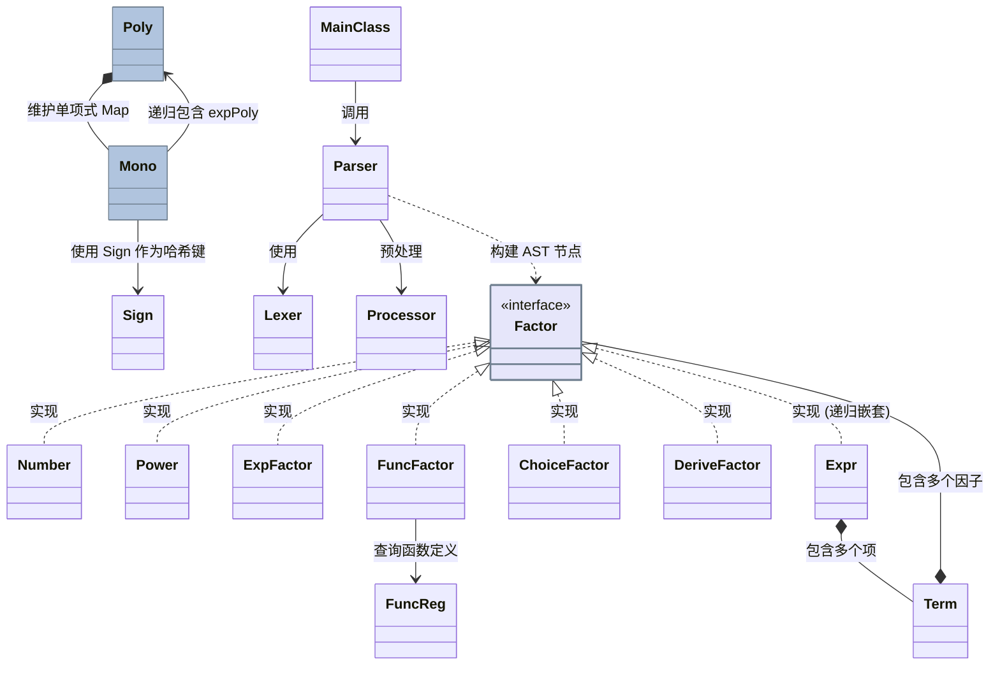

# 第一单元 OO 学习与反思

## 一、 度量分析

### 1. 类与复杂度分析

基于最终的作业代码，我对核心类进行了度量分析：

| Class                  | OCavg | OCmax | WMC  |
| ---------------------- | ----- | ----- | ---- |
| ChoiceFactor           | 1.5   | 2     | 3    |
| DeriveFactor           | 2.5   | 4     | 5    |
| ExpFactor              | 1     | 1     | 2    |
| Expr                   | 1.33  | 2     | 4    |
| FuncFactor             | 2.67  | 5     | 8    |
| FuncFactor.RecCacheKey | 1.67  | 3     | 5    |
| FuncReg                | 1     | 1     | 4    |
| FuncReg.FuncDef        | 1     | 1     | 2    |
| FuncReg.RecDef         | 1     | 1     | 15   |
| Lexer                  | 2.8   | 9     | 14   |
| MainClass              | 3     | 3     | 3    |
| Mono                   | 4.04  | 14    | 105  |
| Number                 | 1     | 1     | 2    |
| Parser                 | 2.09  | 7     | 46   |
| Poly                   | 3.41  | 10    | 58   |
| Power                  | 2.5   | 4     | 5    |
| Processor              | 2     | 2     | 2    |
| Sign                   | 3     | 6     | 9    |
| Term                   | 1.67  | 3     | 5    |

根据表格可以看到，最复杂的三个类依次是 `Mono`、`Poly`、`Parser`。在 `Mono` 类中，我定义了许多方法，不仅包括基本的代数运算（如求导等），还为了追求极致的最短输出长度而定义了化简方法，这在一定程度上违反了单一职责原则。`Poly` 类则相对干练，主要负责加、减、乘、幂等多项式间的数学运算以及转化为字符串的 `toString`。在 `Parser` 中，我采用了递归下降的语法解析方式，针对每一种类型的因子和表达式都编写了解析方法，实现了较好的模块内聚。

### 2. 方法复杂度分析

结合上述类复杂度，我进一步使用工具对部分核心方法进行了度量：

| 方法 | CogC | ev(G) | iv(G) | v(G) |
| --- | --- | --- | --- | --- |
| `Lexer.next()` | 10 | 2 | 8 | 9 |
| `Parser.parseFactor()` | 9 | 7 | 10 | 10 |
| `Poly.equals(Object)` | 10 | 8 | 3 | 9 |
| `FuncFactor.solveRec(int, Poly)` | 8 | 2 | 5 | 5 |
| `Parser.parseRecDef(Scanner)` | 7 | 3 | 4 | 5 |
| `Mono.equals(Object)` | 7 | 7 | 2 | 8 |
| `Poly.power(BigInteger)` | 7 | 3 | 4 | 6 |
| `Poly.multiply(Poly)` | 5 | 2 | 4 | 5 |
| `Mono.derive(String)` | 4 | 1 | 5 | 5 |
| `Poly.toOptimalString(boolean)` | 17 | 7 | 9 | 12 |
| `Mono.toOptimalString(boolean)` | 21 | 5 | 16 | 21 |

从上表可以看出，`Lexer.next()` 和 `Parser.parseFactor()` 的分支极多，因为需要处理各种不同的符号和因子。同时 `Parser.parseRecDef(Scanner)` 和 `FuncFactor.solveRec` 这类函数函数解析和代入时也具有中等规模的控制流复杂度。`Mono` 和 `Poly` 的 `toOptimalString` 承担了输出的任务，这些方法的控制流和圈复杂度非常高，后续如果继续迭代，应考虑将其抽离为独立的 `Printer` 类。
### 3. 类图与设计考虑

**顶层控制与解析模块**

- `MainClass`：程序启动入口和全局调度者。
- `Processor`：预处理模块，主要负责清洗字符串中的连续正负号等。
- `Lexer`：词法分析器，将纯文本字符流转化为 Token 流。
- `Parser`：语法分析器，使用递归下降，将 Token 流转化为抽象语法树（AST）。
- `FuncReg`：全局函数注册表，管理所有自定义函数及递推函数的定义。

**抽象语法树节点**

- `Factor` ：因子接口，通过统一的 `toPoly()` 方法实现了多态。
- `Expr`：表达式节点，由多个 `Term` 的加减组合而成。
- `Term`：项节点，由多个 `Factor` 的连乘组合而成。
- `Number`：常数因子节点，内部封装了大整数。
- `Power`：变量幂因子节点，形如 $x^n$ 或 $y^n$，保存自变量符号及其指数。
- `ExpFactor`：指数函数因子节点，形如 $(\exp(factor))^n$，封装了内部表达式及外层乘方指数。
- `FuncFactor`：函数调用因子节点，负责查表 `FuncReg` 并将具体实参代入。
- `ChoiceFactor`：选择式因子节点，专门保存并解析条件分支表达式 `[?:]` 中的四个判断基元。
- `DeriveFactor`：求导算子因子节点，保存求偏导类型（`dx`, `dy`, `grad`）及其作用的表达式模块。

**核心引擎计算部分**

- `Poly`：程序最核心的计算引擎，使用 `HashMap` 维护单项式集合。它实现了多项式的各种代数运算与合并。
- `Mono`：最小代数运算单元，包含系数、自变量指数级别内部多层嵌套的 `exp` 特征多项式。
- `Sign`：单项式特征类，将 `Mono` 剔除系数后剩余的特征抽取为不可变属性，用作哈希键。

---

## 二、 架构设计体验

我在三次作业中的宏观架构演进一直保持着高度自洽，且具有良好的向后扩展能力。

### HW1：初识递归下降
在 HW1，我紧贴指导书规范，建立了一套“词法分析 ⟶ 语法分析 ⟶ 抽象语法树 ⟶ 多项式计算”的架构。这一模型将表达式严格拆解为 `Expr` ⟶ `Term` ⟶ `Factor` 的文法节点体系。随后，我对所有层级的子节点统一落实了 `toPoly` 这个方法。但在早期理解不深时，我的 `Poly` 更是粗犷地使用 `ArrayList` 线性存储各项 `Mono`，合并同类项时就稍显麻烦了，需要专门建立一个指数到系数的 `HashMap` 来实现。

### HW2：引入指数函数、自定义函数与选择式因子
HW2 引入了指数函数 `exp()`、自定义函数 `f(x)` 以及选择式因子 `[(A==B)?C:D]`。现在单项式不仅有一个 `x` 的指数，还包含了以 `exp` 包裹的多项式。因此我主要做了以下重构：

   1. **重构多项式底层**：首先由于数据范围的变化，`exponent` 类型需要改成大整数类，然后我将 `Mono` 扩展为 `Mono(BigInteger coefficient, BigInteger exponent, Poly expPoly)`。此外，我还引入了内部类 `Sign` ，即去掉系数后的指数和多项式部分， `Poly` 类中的 `ArrayList` ，我也直接换成了从 `Sign` 到 `Mono` 的 `HashMap` ，这下就不需要写合并同类项方法了，而是自动实现合并。其实这里完全也可以用从 `Sign` 到系数的 HashMap ，但这样的话我的 `Mono` 类似乎就有点多余，因此我还是保留了看似复杂的前一种策略。

   2. **函数代入环境字典**：为了实现函数形参替换，我没有选择在字符串层次上进行字符串替换（这种应该很容易 TLE），而是引入了环境字典 `Map<String, Poly> vars`。在每个 AST 节点的 `toPoly` 方法中传入该字典，从而实现函数调用的解析。

而选择式因子对架构没有影响，按原有架构进行添加即可。

### HW3：求导、双变量与递推函数的加入
经过 HW2 的小幅重构，面对 HW3 引入的双变量 `x` 和 `y`、求导算子 `dx/dy/grad` 以及自定义递推函数 `f{n}(x)`，我在架构上几乎没有改动。
对于求导算子 `DeriveFactor`，我在底层的 `Mono` 和 `Poly` 当中补充了专门的求导方法；针对 `y` 的引入，仅需在 `Mono` 类中增加记录 `y` 次幂的专门属性即可。这些新增部分在被 `toPoly` 解析处理后，进行运算的依然是和 HW2 类似的多项式，因此原本的加减乘除及输出逻辑基本不需要修改。

### 新的迭代情景：引入三角函数
如果引入三角函数因子`sin(Factor)` 与 `cos(Factor)` ，并要求合并与化简：
我目前的架构完全禁得住这项考验。我们只需声明 `SinFactor` 和 `CosFactor` 实现 `Factor` 接口，并新增 `Parser` 中的分支即可。真正的深入修改都在底层架构：我们要给 `Mono` 与 `Sign` 追加可以记录三角函数特征的属性。唯一的难点其实在于怎样运用诱导公式或两角和差公式等规律去对合并前的 `Poly` 加以化简而已。

---

## 三、 分析自己程序的 Bug

在这三次作业的强测与互测中，我唯一被测出 Bug 的地方是在 HW3，由于化简优化时复杂度控制不当而导致了 TLE。
- **问题及特征：** 互测房里的同学针对我的代码逻辑，构造了一个使得代码 TLE 的样例。我出问题的类是 `Mono` 中的 `toOptimalString()` 方法。
- **深层原因分析：** 原因是，我设定了多项式的项数在小范围时采用状态压缩 DP。该 Hack 样例利用大量系数相邻的大整数，项数刚好达到我规定的上界，导致程序穷举中产生超时。
- **Bug 复杂度反思：** 回看前面的方法度量分析表，`toOptimalString` 的圈复杂度和认知复杂度都比较高。这说明在编写时引入了过多复杂的逻辑分支。修改这个 bug 的策略，我目前采用的是调小项数搜索范围的上界。

---

## 四、 发现别人 Bug 所采用的策略

在互测环节中，我主要采用了以下策略：

1. **借助 AI 搭建评测机**：我使用 Python 搭建了评测机脚本。策略是通过大量随机生成的数据测试房间内的 8 份作业代码，然后将结果使用 Sympy 库对比来寻找一致性。这能有效找出一些基础的逻辑错误和格式问题，但因为数据是随机生成的，较难定向构造出使得程序 TLE 的极端数据。
2. **结合源码阅读定向构造**：针对评测机难以覆盖的盲区，我会尝试阅读别人的代码来设计测试用例：
   - 比如看到同学处理三目运算符 `[(A==B)?X:Y]` 时将两种选择都进行了计算展开再剪裁，我就会在不选的那一方构造复杂的函数嵌套，使其 TLE。
   - 看到有同学采用 `String.replaceAll` 这种字符串替换来处理函数代入时，便可以尝试构造多层嵌套函数，使其因耗时太长而TLE。

---

## 五、 分析自己进行的优化

我在结果长度的化简优化上主要做了以下工作：
1. **正项优先打印：** 通过遍历 `Poly` 中的各个 `Mono`，找到第一个常数系数为正的项并放到最前面输出，去掉了开头的正负号问题，这种优化十分稳定。
2. **提取公因数：** 对于 `exp(factor)` 类型，我会遍历其内部各个系数的公约数，提取至外部以缩短总体长度。
3. **状态压缩优化：** 对于需要拆开内部的项，当项数处于我设定的小范围时，使用状压 DP 来寻找最优解；超过范围则原样输出。

这些优化虽然缩减了字符串长度，但在保障了代码的常规简洁性的同时，却并未百分之百保证正确性。过于追求局部最短，使得某些化简方法的圈复杂度攀升，在个别极端数据下出现了 TLE 的情况。后续的优化应该更加注意平衡正确性与性能之间的关系。

---

## 六、 大模型相关使用

在三次作业中，我只参考了 AI 给出的架构思路、示例代码和修改建议，并未让其直接编写我的代码。当遇到输出错误、抛异常或是搭建评测机时的各种问题，将报错结合代码抛给 AI 排查，效果往往非常好。总之，AI 经过提示后可以精准发现代码逻辑方面的问题，并帮忙修补漏洞。但对于时间复杂度分析和构造那些能让代码运行超时的极端数据，它由于没有全局运行环境概念，仍显力不从心，这时候人工阅读源码构造更为可靠。

---

## 七、 心得体会

经过本单元的学习，我还是收获颇丰的。一开始听说我们要进行表达式深层编译解析时，便想起原先学后缀表达式时的痛苦。但是递归下降和抽象语法树的方法极大地解耦了难度。表达式先被切分为一个个 Token，再由 Parser 解析对应部分，最终建立 AST。这时节点统一实现的 `toPoly()` 方法发挥功能，将一切降维成多项式，自下而上依次化简计算即可。相对之前理解的后缀表达式，代码行数虽然变多了，但可读性和扩展性却实现了质的飞跃。

关于 AI 的使用，如今的 AI 驾驭 OO 作业可以说游刃有余了。我会借此设计架构、学习算法以及进行 Debug 和辅助构造测试，总体效果不错。但同时也深刻体会到，面向对象编程的相关思考与代码掌控等修养，依然是无法被 AI 工具完全替代的。

---

## 八、 未来方向建议

整体而言，我们的 OO 课在难度递进设计上已经非常合理了，第一单元的课程安排也很完备。唯独建议在性能优化方面，可以再多给一些相关的指导提示，或者在单元结束后公布一下 std 标程用的具体优化方法。我还是十分好奇采用什么方法能在时间限制下将表达式化至最短的。

---

## 九、 思考题

### **1. 如何检查输入是否符合要求？**

建议进行双重检查，大致如下：
首先在预处理入口处：使用正则表达式扫描字符串，排查非法符号、不合规操作符组合（如 `**` 等）。第二层在 `Parser` 递归下降流程中：如果遇到偏离文法规则的分支，可以直接抛出对应的自定义异常。

### **2. 如何精确计算一个合法输入的 cost？**

通过在各个抽象语法树节点类中声明 `getCost()` 方法，可以实现自顶向下的递归计算。对于基础的加减乘除和常数，直接按指导书的运算法则进行累加或相乘；对于函数调用，需要将实参代入到函数定义的 AST 中生成新表达式，再递归计算；对于选择式因子，必须在计算时判断条件表达式是否恒等，从而动态累加正确分支的代价；最后，由于求导等算子涉及代价的指数增长，在内部实现时需使用 `BigInteger` 来防溢出。
