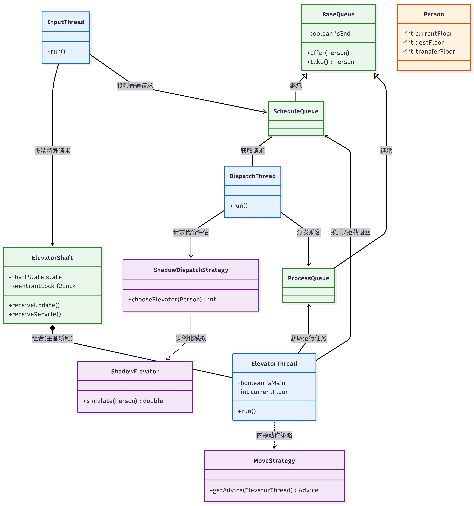

# 第二单元 OO 学习与反思

## 一、同步块的设置和锁的选择

### 锁的设置与演变

- **第五次作业**：一开始，为了稳妥，我把主要的同步块都放在了共享的 `BaseQueue` 里， `offer`、`take`、`isEmpty` 这些方法全加上了 `synchronized`。这时候逻辑比较简单，锁住队列本身就能解决大部分并发读写的问题，线程等待也是靠 `wait()` 和 `notifyAll()` 在队列对象上完成。

- **第六次作业**：到了第六次作业，加了检修机制和自由分配电梯的逻辑。我在各个电梯井 `ElevatorThread` 里加了一些状态控制，由于状态会被电梯和调度器同时访问，我在通知电梯改变状态的时候，借用了电梯专属的 `processQueue` 的锁来做 `notifyAll`。此时调度器 `DispatchThread` 拿 `scheduleQueue` 的锁，电梯拿自己的 `processQueue` 锁，分工明确，基本没有问题。

- **第七次作业**：这次的重点是换乘层 F2 的防撞。我给 `ElevatorShaft` 专门加了个显式的公平锁 `ReentrantLock f2Lock`。当任意一轿厢需要进入 F2 层时，必须在执行 `moveOneFloor` 前通过 `f2Lock.lock()` 获取锁，离开后释放锁。同时，我将处理语句精简为仅包含进入、停留和离开 F2 层的动作，使锁的粒度最小，保证安全的同时最大化了电梯的效率。

### 锁与同步块内处理语句的关系

随着作业迭代，我逐渐体会到，锁的作用不仅仅是“互斥”，更是为了保证同步块内的一组处理语句原子性地维护某个对象的属性，我们不能把紧密关联的操作拆分到不同的同步块中。

- **队列的存取操作**：在执行 `offer` 和 `take` 时，“检查队列状态”、“修改队列元素”、“唤醒等待线程”必须包裹在同一个 `synchronized` 块中。如果将检查和取数分开，就可能出现两个线程同时判断队列非空，然后试图取出同一个请求的危险情况。
- **状态修改与通知的绑定**：在 hw6 中，调度器往电梯派发新请求或下发指令时，“修改共享状态”和“调用 `notifyAll()`”这两步处理语句必须在同一个同步块内完成。如果先修改状态，出锁后再去 `notifyAll`，这期间电梯可能恰好去检查状态并因错过了通知而陷入无休止的等待。
- **多条件检查的原子性**：在 hw7 的 F2 防撞逻辑中，“检查对向轿厢是否占用 F2”以及“登记当前轿厢即将进入 F2”这两步处理语句，必须包裹在同一个 `f2Lock` 的临界区内。如果检查和登记被拆分，两部轿厢可能在同一时刻都发现 F2 空闲，并同时进入 F2 发生碰撞。

## 二、调度器设计

### 调度器交互设计

我的代码采用了层次化的调度架构：`InputThread` -> `ScheduleQueue` -> `DispatchThread` -> `ProcessQueue` -> `ElevatorThread`，如下图所示。

调度器 `DispatchThread` 作为中枢，一旦有新乘客请求，就将其从 `ScheduleQueue` 中取出，并通过策略类 `ShadowDispatchStrategy` 为其分配最合适的电梯，最后将乘客放入对应电梯的 `ProcessQueue` 中，并通过 `notifyAll()` 唤醒处于等待状态的电梯。这种设计实现了调度与执行的解耦，调度器不需要干预电梯的运行状态，只需通过队列进行基于数据的交互。

### 调度策略与性能指标

- **运行策略**：单部电梯采用了经典的 `LOOK` 算法，在当前方向上有请求时继续运行，否则反转方向，能有效减少不必要的移动时间。
- **分配策略**：从第六次作业开始，我实现了“影子电梯”策略。在分配乘客时，系统会深拷贝每一部电梯的当前状态，在后台通过模拟该电梯运行完所有请求以及所需的代价。
- **多指标权衡**：我影子电梯的代价函数综合考虑了运行时间和耗电量。时间代价根据模拟运行到达目标层的时间计算，耗电量代价则根据模拟过程中的 `ARRIVE`、`OPEN/CLOSE` 次数计算，最终将指标加权求和，寻找代价最小的电梯进行分配。针对可能的维护和双轿厢改造与回收，调度器会给这些电梯一些惩罚，避免将新乘客分配给它们。

## 三、bug分析与debug方法

### 出现过的bug

我只有 hw7 互测中被人发现了bug。错误的输出部分如下：

```text
[49.8510]RECYCLE-ACCEPT-7
[49.8520]RECYCLE-BEGIN-7
[49.8530]RECEIVE-100-7
```
原因是副轿厢 7 已经进入了 `RECYCLE_BEGIN` 状态，却还 `RECEIVE` 了新乘客。经过我的排查，发现我的调度器在计算代价的时候，副轿厢 7 的状态可能还是正常的（或者正好处于 `REC_ACCEPT`）。调度器决定把乘客分给 7 号，但是在它计算完、准备输出接受信息的微小时间间隙里，副轿厢 7 直接把乘客清空、关门，并输出了 `RECYCLE-BEGIN` 改变了状态。等调度器输出 `RECEIVE` 的时候，副轿厢 7 已经变成不可接收请求的状态了。总的来说，是因为我电梯调度和输出 `RECEIVE` 并没有被包裹在同一个原子操作里，导致被其他线程修改了状态。

### 多线程程序的debug方法

经历了这三次作业，我总结出了一套多线程调试方法：

1. **理清共享对象边界**：在排查问题前，先明确哪些对象会被多个线程同时读写。对于不共享的局部状态，交由电梯线程独占推进即可，不需要过度担心并发。
2. **重点排查线程唤醒逻辑**：可以利用输出语句检查 `wait()` 和 `notifyAll()` 的配对情况。特别关注如输入关闭、状态转换等边界事件，看看是否在这些特殊时刻漏了唤醒，导致线程睡死。
3. **针对输出日志反推状态**：多线程由于难以稳定地单步断点调试，我们往往去参考输出日志。我会检查 `RECEIVE`、`IN`、`OUT` 是否成对出现，电梯的各种输出顺序是否符合题意。对报错的特定行，我根据前面的输出反推当时各个线程所处的状态。
4. **搭建评测机**：我依旧会搭建评测机来进行高强度的生成请求。一旦评测报告错误，立马固定测试用例，保留当时的输入输出，然后再进行针对性的排查。

## 四、线程安全与层次化设计

### 线程安全
线程安全不是随意在方法上加 `synchronized` 就能实现，滥用锁反而会导致性能下降和死锁。我感觉，理清数据流动的模型是保障线程安全的前提。U2 中，只有队列被多个线程共享，因此只需将队列封装为线程安全的类。对于电梯内部的载重、当前楼层等状态，只由电梯线程自己修改，天然是线程安全的，不需要额外加锁。同时，一定要保持锁的获取顺序一致，并避免在同步块内调用耗时的方法。

### 层次化设计
层次化设计也有效降低了系统的耦合度。从数据流向上，我的架构可以划分为“输入层 -> 分派层 -> 执行层”。从类的结构上，我将“执行动作（ElevatorThread）”、“运行策略（MoveStrategy）”和“分配策略（ShadowDispatchStrategy）”严格剥离。面对 hw7 的复杂需求，由于具备良好的层次结构，我只需在电梯井层面维护两部电梯，并引入题干中新增的几个状态，而无需重构底层移动和开关门等逻辑。

## 五、大模型使用心得

- **模型名称**：Gemini
- **任务分工**：我负责架构设计和核心状态机的定义等，并编写主要的核心代码，只有不太熟悉的地方，如 `synchronized` 等多线程相关代码的写法，才会询问大模型。写完后，大模型负责帮我检查代码逻辑和 debug，比如说影子电梯深拷贝代码等。
- **复杂任务中的优势**：在面临多线程电梯这样复杂的任务时，大模型的逻辑梳理能力非常突出。当我描述双轿厢改造流程时，它能迅速生成清晰的状态机框架；在排查死锁时，把相关输入输出描述给大模型，它思考后往往能一针见血地指出问题。
- **面临的困难**：大模型由于缺乏整体代码库的上下文，有时会“自作主张”地引入一些不需要的类，如果直接复制粘贴，极易引入隐蔽的 bug。
- **总体感受**：大模型是一位极为高效的助手，但多线程代码的底线还是必须由我们把控。只有自己深刻理解了并发机制，才能审查 AI 代码，将其转化为真正的生产力。

## 六、第二单元的体验与建议

### **真实感受**

第二单元的电梯作业无疑是 OO 中思维跨度最大的一环，从串行转向并发是一个痛苦但也充满成就感的过程。hw6 中，我设计影子电梯调优耗费了大量精力，第七次作业的双轿厢逻辑中我也遇到了很多的细节问题，比如说在 F2 换乘的写法等。但最终看着电梯高效地运送着乘客而不发生任何死锁，这种获得感也是难以言喻的。

### **课程建议**

希望能稍微介绍一下相关电梯调度名词具体是什么意思，比如量子电梯、自由竞争等，网上相关的资料也很少。