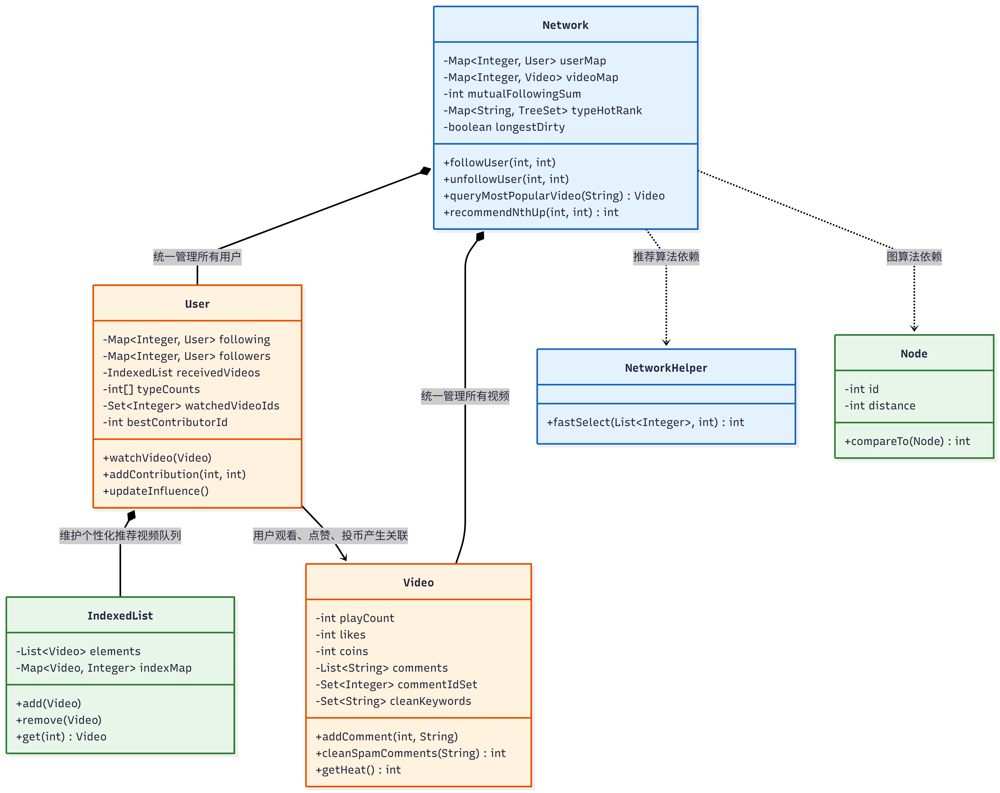

# 第三单元 OO 学习与反思

## 一、JML 和规格驱动开发

### JML 契约式设计
JML 本质上是在 Java 接口外面再套一层形式化约束。它通过 `requires`、`ensures`、`assignable` 和 `signals` 等，明确了方法的前置条件、后置条件、可修改状态以及异常抛出条件。相比于自然语言，JML 可以准确地约束方法的规格。在 OOP 中，它作为实现者与调用者之间的契约，消除了语义上的歧义。

### 规格驱动开发
这一单元最明显的变化就是写代码前先看规格。规格开发的主要优势有：
1. **实现自由度与结果约束**：只要对外状态满足 `ensures`，内部用 `HashMap`、`TreeSet`，还是自己写容器，都可以。比如有的方法 JML 写得像全局遍历，但实现时完全没必要照着翻译成循环。只要返回值和状态变化对，内部可以做缓存，也可以增量维护。
2. **测试驱动**：JML 为测试提供了清晰的依据。通过直接对照 `ensures` 和 `signals` 子句，可以很容易地推导出测试的分支和边界情况，从而编写出高覆盖率的单元测试。

## 二、JUnit 测试经验总结

在本单元的测试中，我针对 JML 的完整性进行验证，包括正常结果返回、状态变化以及异常情况，体现在以下三个方法的测试中：

`queryMutualFollowingSum` 的测试里，我没有复用 src 里动态维护 `mutualFollowingSum` 的逻辑，而是单独写了一套双重遍历节点的朴素算法。这样测出来才有意义。数据覆盖了空图、单向关注、对称互关、不成环这些情况，主要用来确认边增删之后缓存计数没有跑偏。

测 `cleanSpamComments` 时，麻烦点在副作用。这个方法会改评论列表，所以调用前要先做快照。测试除了看删除数量和关键字最大出现次数，还要看剩下的评论顺序是否保持，`playCount`、`likes` 这类无关属性有没有被动到。针对字符串匹配，我补了通配符边界词和重叠匹配，以确保严格符合题目要求。

`recommendNthUp` 更偏排序规则。测试覆盖了 `rank` 非法、候选集为空、分数相同按 ID 排序、排除自己和已关注用户等情况。它是纯查询方法，所以我还测了连续调用后内部状态不变。

## 三、三次作业的迭代

### 第一次作业：社交图谱与视频推送

第一次作业主要是基础的用户社交图谱和视频推送。为了保证查询效率，我在 `Network` 里用 `HashMap` 管理 `userMap` 和 `videoMap`。

在用户关系维护方面，我直接在 `User` 类中使用两个 `HashMap`（`following` 和 `followers`）来记录关注和被关注关系，以此替代低效的全局查找。`queryMutualFollowingSum` 我没有每次重新算，而是在 `followUser` 和 `unfollowUser` 里动态维护 `mutualFollowingSum`，查询时就是 O(1)。

视频接收这里，`receivedVideos` 经常要头插，所以我写了一个 `IndexedList`。另外，`User` 里维护长度为 4 的 `followerAgeCounts` 数组，以此在 O(1) 的时间内返回各个年龄段粉丝的占比。

### 第二次作业：互动状态与缓存

第二次作业引入了点赞、投币、视频热度等互动状态。难点不是某个单独方法，而是一次操作会牵连多个对象。比如投币要改用户余额、视频硬币数、UP 主硬币数，还要在 `User` 的 `contributions` Map 里更新贡献度。

为了少做全量查询，我在 `User` 里维护了 `watchedVideos`、`likedVideos` 等集合，也用 `contributions` 存各个用户的贡献度。`Video` 里添加评论时用 `commentIdSet` 防重。`cleanSpamComments` 用双指针配合 `comments.subList().clear()` 清理，避免一边遍历一边频繁删除。清理过的关键字用 `cleanKeywords` 记下来，防止重复计算。

`queryLongestDecSeq` 是这一阶段比较容易 TLE 的点。我用了 `longestDirty` 脏位和 `longestDecSeqCache` 缓存。图结构没变就直接返回缓存；只要关注关系变化，就把脏位打上，从而保证了平均情况下的高查询效率。

### 第三次作业：热度推荐与模块化

第三次作业加了推荐相关方法，代码量已经快超 500 行了（不过好像听说代码风格测试并不卡500行？），我在 `Network` 里尽量只做调度，把具体状态维护放回实体类。

`queryMostPopularVideo` 用了 `Map<String, TreeSet<Video>> typeHotRank`。`TreeSet` 按 `heat` 和 `id` 排序。凡是会影响视频热度的操作，更新前先从对应 `TreeSet` 里移除，改完热度再插回去。这样每种类型的视频都能保持有序，查询最热视频时不用临时排序。

`User` 的 `influence` 也没有每次遍历所有上传视频，而是在热度变化时通过回调增量更新 `influences` 数组。`recommendNthUp` 用了类似快速选择的策略，避免全量排序。写完这块以后最大的感觉就是：推荐逻辑不难，难的是别让它把前面维护好的状态一起拖慢。

## 四、如何发现迭代中的方法和容器变化

在历次作业中，准确找出需要修改的方法和容器是很重要的一环。我发现不能只看新增加的方法，已有的老方法在规格上也可能发生了变化。

首先是对比接口暴露的状态模型。比如在第三次作业中，`UserInterface` 的模型描述里新增了关于不同类型视频的数量统计要求。看到这个新增的模型属性，我就在 `User` 类中新增了一个 `typeCounts` 数组，在每次观看视频时同步更新它。

其次是检查副作用 `assignable` 的变化。有时候老方法的代码核心逻辑没变，但在新版本中允许修改的变量范围变大了。比如有的方法原本只修改自身属性，后来允许修改其他类的集合。如果漏看了这部分 `assignable` 的扩展，只按原来的逻辑写，就会导致数据没有同步更新。

另外就是对比方法签名。如果返回类型或参数数量如果变了，原来调用的地方和涉及的数据存储格式基本都需要做相应的修改，这一点编译器通常会报错提示，但也需要我们去更新相关的代码链路。

## 五、如何发现性能瓶颈

JML 只描述结果要求，不会考虑底层的计算开销。如果直接把规格翻译成循环，强测里基本迟早会出事。

我会先看量词复杂度。如果 JML 里出现了多重嵌套的 `\exists` 和 `\forall`，或者要求计算全局的 `\sum`，把它直接写成嵌套循环一般就会达到 O(N²) 以上的复杂度。遇到这类方法，我会在本地造一些比较大的数据来测试它的执行时间。

然后看读写频率。对于像互相关注总数、粉丝年龄分布这种查询次数远大于修改次数的属性，每次查询都重新计算显然太慢了。我选择在关注、取关等操作发生时顺便更新这些值。就像代码里维护 `bestContributorId` 一样，通过增量维护把复杂度降下来。

图算法更适合缓存。像 `queryLongestDecSeq` 这种方法每次计算开销很大，我采用了带脏位的缓存机制。不过使用缓存时必须保证状态的一致性，也就是在任何会改变图结构的方法里，都要记得把 `longestDirty` 设为 true，防止出现缓存和实际状态不符的问题。

## 六、Bug 与原因分析

得益于规格驱动开发的严谨性，在三次作业的中测、强测和互测环节中，我的代码都没有被测出 Bug。期间还发生了一个小插曲：在 hw10 的强测中，由于评测机波动，第六个数据点最初被误判为错误，好在后续重测后证实了那只是评测机自身的问题。这虽然让我虚惊一场，但也最终证明了代码的正确性。

不过在本地开发迭代的过程中，我也踩过一些坑。这些经历让我意识到规格开发中有几个很容易出错的地方：
1. **遗漏副作用**：在 hw10 迭代过程中，增加投币功能时，不仅要修改视频本身的 `coins`，还需要同步增加该视频上传者的 `coins` 以及记录 `contribution`。起初我没有仔细对照 JML 中新增的 `assignable` 语句，只修改了视频侧，结果状态不同步。多对象更新基本可以当成一个小事务处理，不能有一丝遗漏。
2. **异常抛出顺序**：JML 规格中异常不仅有明确的判断先后顺序，构造异常时传入的 ID 参数也有严格要求。最初我在抛出异常时未按规则排序，或者传入的 ID 顺序错位，导致 JUnit 测试中捕获到的异常信息不匹配。

## 七、大模型使用体会

这一单元里，我更愿意把大语言模型当规格阅读助手和评测机生成器，而不是直接写最终代码的工具。我使用的 Code Agent 主要是 Codex 。

它的显著优势在于：可以快速把长篇的 JML 翻译成自然语言、列出可能的边界条件、提醒某个方法需要检查哪些副作用，还可以帮助生成繁琐的 JUnit 单元测试。使用这些 Agent 来开展自动化测试、批量构造测试样例等还是很方便的，极大地提高了效率。对于版本变更比对，将新旧版本的接口文件发给它，它能迅速列出所有变更点，比肉眼比对高效得多。

但大模型的局限性也很明显：它往往倾向于直译 JML，给出“看起来正确但慢”的朴素实现，完全忽略强测中的性能压力。要想让大模型设计出好的架构或是恰当的设计模式，需要我们提供极高质量的提示词。因此我经常使用一些提示词优化器来优化我的输入，向大模型更精准地传达意图，从而引导其输出更优的方案。

## 八、JML“击鼓传花”研讨课感悟

在第二次研讨课上的 JML “击鼓传花”游戏中，我获得了许多关于团队协作的启发。

在本次活动中，我所在的链路题目是计算两个正整数的最大公约数。初始的自然语言需求明确规定了接收正整数 a 和 b，前置条件为大于 0，且在输入小于等于 0 时抛出 `IllegalArgumentException` 异常。

### 1. 发现的 JML Bug
在从 JML 翻译回自然语言，或者从 NL 编写 JML 的过程中，很容易出理解的偏差。例如在我们组其他同学的链路中，就出现了：
- **边界条件遗漏或变形**：有的同学在 JML 转自然语言时遗漏了边界条件，把 `>= 0` 错误地记作了 `> 0`。或者对于某些特殊边界，原本要求返回“空 Map”，在传递中却被替换成了“返回 null”。
- **逻辑符号被忽视**：在转述过程中，某些逻辑非符号（`!`）极容易被忽视，导致某一处表述出现明显的语义反转和偏离。
- **异常触发条件写错**：自然语言表述的异常抛出条件由于不够严谨，导致后续在写 `signals` 子句时发生偏离。

### 2. 需求与边界在传递中的变化
游戏过程中，需求和边界常常会发生不可逆的变化。不过，因为我出的 gcd 题目数学逻辑比较纯粹，大家都不容易搞错，所以我们这条链路取得了 5 分满分。这也让我体会到：只要初始的需求足够严谨，后面传错的概率就小很多。有些自然语言觉得理所当然的条件，必须得像数学公式一样一条条严格约束，不然很容易产生误解。

### 3. 多人组队编程的建议与措施
为了在未来的多人开发中统一对需求的理解，我认为应该采取以下措施：
- **统一接口规范**：JML 的核心在于提供接口规范，而不是强制所有人写出一样的代码。我们只要求大家的实现符合一个统一的接口，至于方法内部实现只要没有性能瓶颈，无需强行统一。
- **严格定义初始需求**：在动手编码前，需求分析必须做到形式化般的严谨。即便是看似简单的自然语言，也要杜绝任何歧义，明确写出前提和异常分支。
- **多重细致校验**：在代码编写时，必须进行细致的逻辑复盘，严防类似遗漏 `!` 等低级错误造成雪崩。
